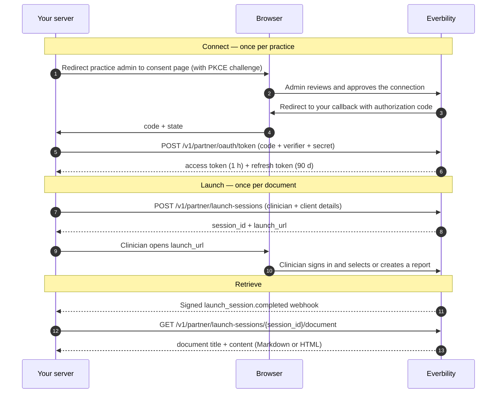

The Partner API lets practice management systems and other platforms embed Everbility's report writing into their own workflow. Your platform starts a **launch session** for a client, the clinician writes the report in Everbility under their own login, and your platform retrieves the finished document.

Unlike the [Public API](/developer-docs/index), which uses per-user API keys, the Partner API is built for third-party platforms: a practice admin connects your app once with OAuth 2.0, and your server acts on behalf of that whole practice.

<Info>
Partner apps are provisioned manually. Email [support@everbility.com](mailto:support@everbility.com) to register as a partner and receive your OAuth `client_id` and `client_secret`. If you enable webhooks, Everbility also gives you a separate `webhook_secret`.
</Info>

## How it works



## The three building blocks

<CardGroup cols={3}>
  <Card title="Connection" icon="plug" href="/developer-docs/partner/connect">
    A practice admin approves your app once. You exchange the authorization code for tokens and refresh them on a 90-day rolling window.
  </Card>
  <Card title="Launch session" icon="rocket" href="/developer-docs/partner/launch-sessions">
    A single report-writing hand-off. You create it with a clinician email and your client ID, then send the clinician to the `launch_url`.
  </Card>
  <Card title="Document retrieval" icon="file-lines" href="/developer-docs/partner/launch-sessions#retrieve-the-completed-document">
    Receive a completion webhook, then pull the rendered report as Markdown or HTML into your platform.
  </Card>
  <Card title="Webhooks" icon="webhook" href="/developer-docs/partner/webhooks">
    Receive signed session opened, completed, and expired events.
  </Card>
  <Card title="Branding" icon="palette" href="/developer-docs/partner/branding">
    Download approved assets and add an Open in Everbility button.
  </Card>
</CardGroup>

## Base URL

```text
https://api.everbility.com/v1/partner
```

All partner endpoints, including the OAuth token endpoint, live under this prefix. See the [API reference](/developer-docs/api/overview) for full request and response schemas.

## Client mapping

Your platform and Everbility each have their own client records. The first time a clinician opens a session for one of your clients, Everbility asks them to link it to an Everbility client (or they create one). The mapping is remembered per connection, so every later session for that `external_client_id` skips straight to writing.

## Lifetimes at a glance

| Credential / object | Lifetime | Notes |
| --- | --- | --- |
| Authorization code | 5 minutes | Single use. A new approval invalidates any outstanding codes. |
| Access token | 1 hour | Opaque bearer token for all partner endpoints. |
| Refresh token | 90 days | Single use — each refresh returns a new pair (rotation). |
| Launch session | 48 hours | Fixed from creation; activity does not extend it. Expiry does not delete saved reports. |

## Security model

- **PKCE is mandatory.** Every authorization uses `code_challenge_method=S256`, in addition to your `client_secret`.
- **Tokens are opaque and hashed at rest.** Everbility stores only SHA-256 hashes of codes, tokens, and your client secret.
- **Webhook signing uses a separate secret.** It is not derived from your OAuth `client_secret`. Everbility stores the webhook secret encrypted and decrypts it only when signing a delivery.
- **Refresh tokens rotate.** Reusing an already-consumed refresh token revokes the whole token family and flags the connection for re-authorization.
- **Clinicians use their own login.** Your platform never handles Everbility user credentials; sessions are bound to a specific clinician by verified email.

## Start here

<Steps>
  <Step title="Get credentials">
    Email [support@everbility.com](mailto:support@everbility.com) with your redirect URI and optional webhook URL. Everbility gives you an OAuth `client_id` and `client_secret`, plus a separate `webhook_secret` when webhooks are enabled.
  </Step>
  <Step title="Connect a practice">
    Send a practice admin through the [consent flow](/developer-docs/partner/connect) and exchange the code for tokens.
  </Step>
  <Step title="Launch and retrieve">
    Create a [launch session](/developer-docs/partner/launch-sessions), hand the clinician the `launch_url`, and retrieve the document after the completion webhook.
  </Step>
</Steps>

## Before you go live

- Register a separate partner app, redirect URI, webhook URL, and credential set for each environment.
- Store OAuth tokens, the OAuth client secret, and the webhook secret in a server-side secret manager.
- Persist each rotated refresh-token pair atomically so you never reuse a consumed refresh token.
- Generate a unique `Idempotency-Key` for each logical launch session and reuse it only when retrying that request.
- Verify webhook signatures against the raw request bytes, reject stale timestamps, and deduplicate by event ID.
- Keep session-status polling as a recovery path if webhook delivery reaches its final retry.
