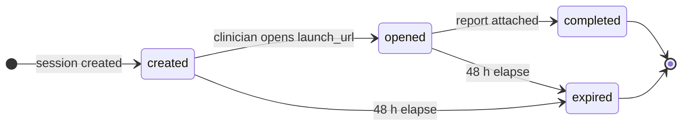

A **launch session** is one report hand-off: your platform creates it, the assigned clinician chooses a report in Everbility, and your platform pulls the selected document back. Sessions expire **48 hours after creation** if not completed.

The expiry is fixed. Opening the session, returning to it, or checking its status does not extend the deadline. Closing the Everbility tab has no effect, and expiry does not delete reports saved in Everbility.

All endpoints on this page require a partner access token from the [connect flow](/developer-docs/partner/connect):

```http
Authorization: Bearer pat_...
```

## Create a session

`POST /v1/partner/launch-sessions` with a required `Idempotency-Key` header:

```bash
curl -s https://api.everbility.com/v1/partner/launch-sessions \
  -H "Authorization: Bearer pat_..." \
  -H "Idempotency-Key: 018f6a1c-5b7e-7c4d-9f3a-2f6f1f6f9d42" \
  -H "Content-Type: application/json" \
  -d '{
    "external_client_id": "your-client-42",
    "clinician_email": "jordan@examplepractice.com",
    "client_first_name": "Alex",
    "client_last_name": "Nguyen"
  }'
```

```json Response
{
  "session_id": "psess_Zl9nB1qFhOQe2kQ4rW8xJ3Ty",
  "status": "created",
  "launch_url": "https://www.everbility.com/partner-sessions/psess_Zl9nB1qFhOQe2kQ4rW8xJ3Ty",
  "expires_at": "2026-07-08T04:15:00Z"
}
```

| Field | Required | Description |
| --- | --- | --- |
| `external_client_id` | Yes | Your platform's ID for the client (max 255 chars). Used to remember the client mapping across sessions. |
| `clinician_email` | Yes | Must match the **verified** email of exactly one member of the connected practice. Matching is case-insensitive. |
| `client_first_name` | No | Shown to the clinician when they map the client for the first time. |
| `client_last_name` | No | Shown to the clinician when they map the client for the first time. |

<Note>
**Idempotency.** Retrying with the same `Idempotency-Key` and identical body returns the original session instead of creating a duplicate. Reusing a key with a *different* body fails with `409 Idempotency-Key conflict`. Use a fresh UUID per logical session.
</Note>

## Hand off to the clinician

Open `launch_url` for the clinician — as a link, button, or embedded browser view from your platform. From there, Everbility takes over:

<Steps>
  <Step title="Sign in">
    The clinician signs in with their own Everbility account. Only the clinician matched by `clinician_email` can open the session. The launch link does not create a restricted Everbility account: the clinician retains their ordinary Everbility permissions.
  </Step>
  <Step title="Map the client (first time only)">
    If this `external_client_id` has not been seen before on this connection, the clinician links it to an Everbility client or creates a new one. The mapping is remembered, so later sessions for the same client skip this step.
  </Step>
  <Step title="Choose and complete">
    The clinician creates a new report or selects an existing report for the mapped client, then chooses **Send to [partner]**. A report belonging to another client cannot be sent through the session.
  </Step>
</Steps>

## Poll session status

```bash
curl -s https://api.everbility.com/v1/partner/launch-sessions/psess_Zl9nB1qFhOQe2kQ4rW8xJ3Ty \
  -H "Authorization: Bearer pat_..."
```

```json Response
{
  "session_id": "psess_Zl9nB1qFhOQe2kQ4rW8xJ3Ty",
  "status": "completed",
  "created_at": "2026-07-06T04:15:00Z",
  "opened_at": "2026-07-06T04:22:41Z",
  "completed_at": "2026-07-06T05:03:12Z",
  "expires_at": "2026-07-08T04:15:00Z",
  "document_url": "/v1/partner/launch-sessions/psess_Zl9nB1qFhOQe2kQ4rW8xJ3Ty/document"
}
```



| Status | Meaning |
| --- | --- |
| `created` | Session exists; the clinician has not opened it yet. |
| `opened` | The clinician has opened the session in Everbility. |
| `completed` | A document is attached — `document_url` is now populated. |
| `expired` | The fixed 48-hour window lapsed, or the connection was revoked, before completion. Terminal; saved reports are not deleted. |

Use [webhooks](/developer-docs/partner/webhooks) for normal status updates. Polling remains available as a recovery mechanism or when a user views the record in your platform.

## Retrieve the completed document

Once `status` is `completed`, fetch the rendered report:

```bash
curl -s "https://api.everbility.com/v1/partner/launch-sessions/psess_Zl9nB1qFhOQe2kQ4rW8xJ3Ty/document?format=html" \
  -H "Authorization: Bearer pat_..."
```

```json Response
{
  "session_id": "psess_Zl9nB1qFhOQe2kQ4rW8xJ3Ty",
  "title": "Functional capacity report",
  "everbility_client_id": 864,
  "format": "html",
  "content": "<h1>Functional capacity report</h1>..."
}
```

Use `format=markdown` (default) or `format=html`. HTML retrieval removes Everbility's default fixed `75px` table-cell widths so tables can use the width available in your application; other explicit widths are preserved. The document stays available on the completed session, so you can re-fetch it after the 48-hour session window.

## Errors

| Status | Detail | Cause |
| --- | --- | --- |
| `400` | `Idempotency-Key is required` | Missing or blank `Idempotency-Key` header on create. |
| `400` | `clinician_email_not_resolved` | The email does not match exactly one verified member of the connected practice. |
| `401` | `Invalid bearer token` | Access token missing, expired (1 h), or revoked — refresh and retry. |
| `401` | `Invalid partner connection` | The connection was revoked or needs re-authorization. |
| `403` | `client_access_denied` | The mapped Everbility client is not accessible to the assigned clinician. |
| `404` | `Session not found` | Unknown `session_id`, or it belongs to a different connection. |
| `409` | `Idempotency-Key conflict` | Key reused with a different request body. |
| `409` | `Session not completed` | Document requested before the session reached `completed`. |
| `410` | `Session expired` | Document requested on an expired session. |

Errors use the standard shape:

```json
{ "detail": "Session not completed" }
```
